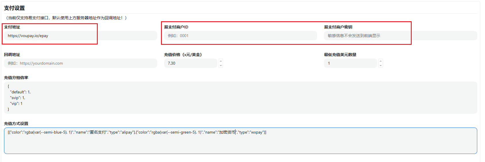

# New API 支付设置

`QuantumNous/new-api` 接入 VouPay 时，只需要在后台支付设置页填写以下内容。

## 必填项

| 配置项 | 填写内容 |
| --- | --- |
| 支付地址 | `https://voupay.io/epay` |
| 易支付商户 ID | 在 <https://voupay.io/dev/dashboard> 获取 |
| 易支付商户密钥 | 在 <https://voupay.io/dev/dashboard> 获取 |
